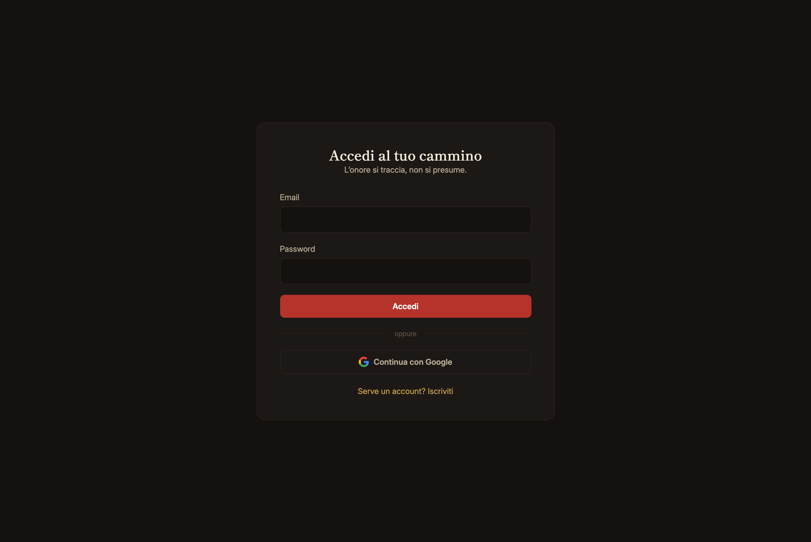
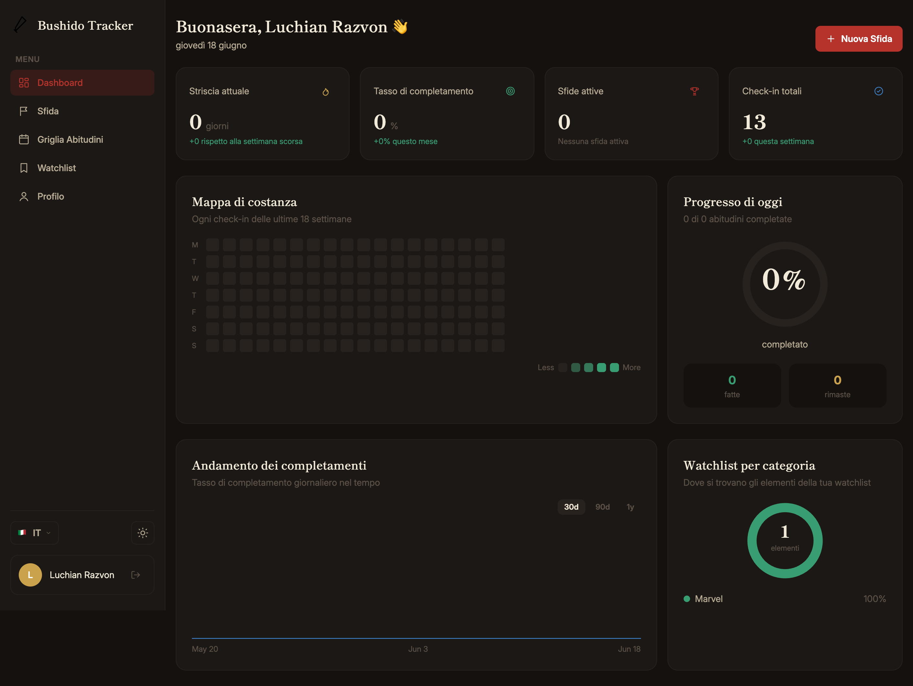
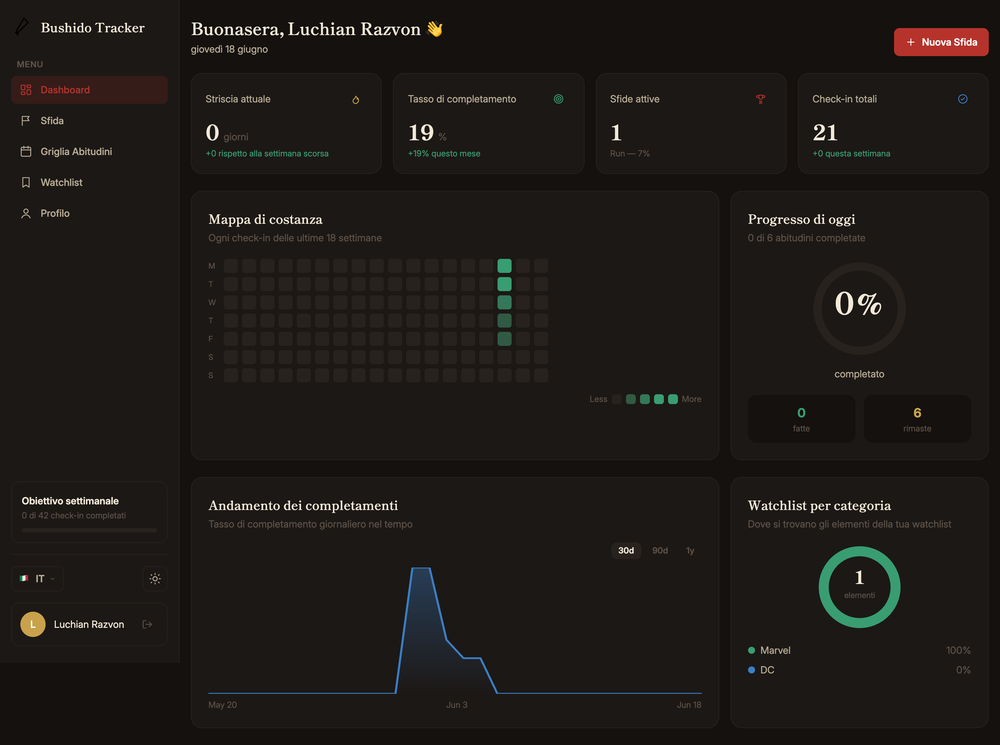
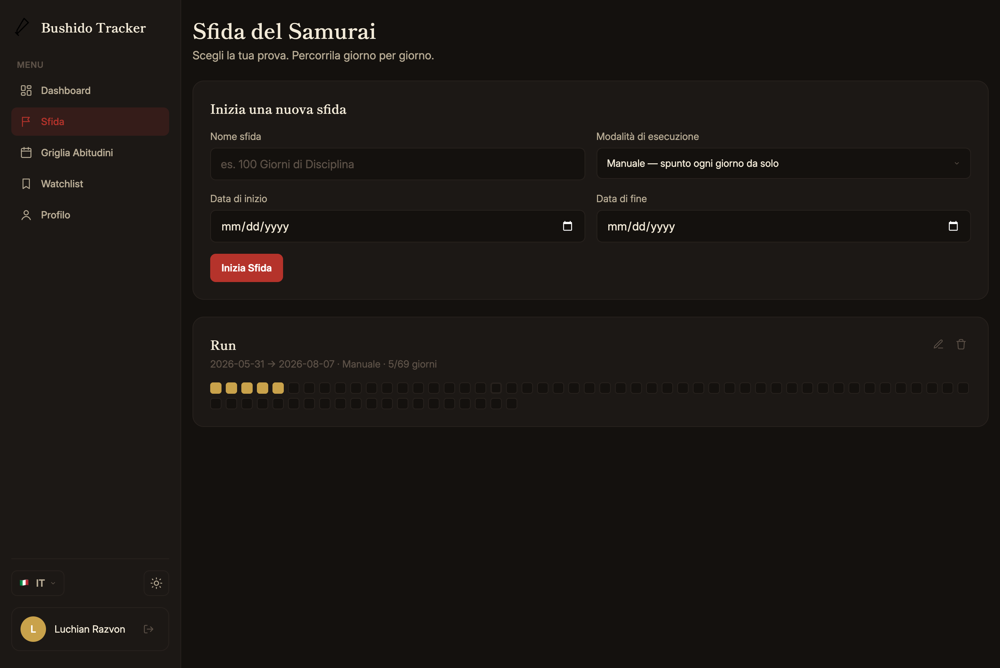
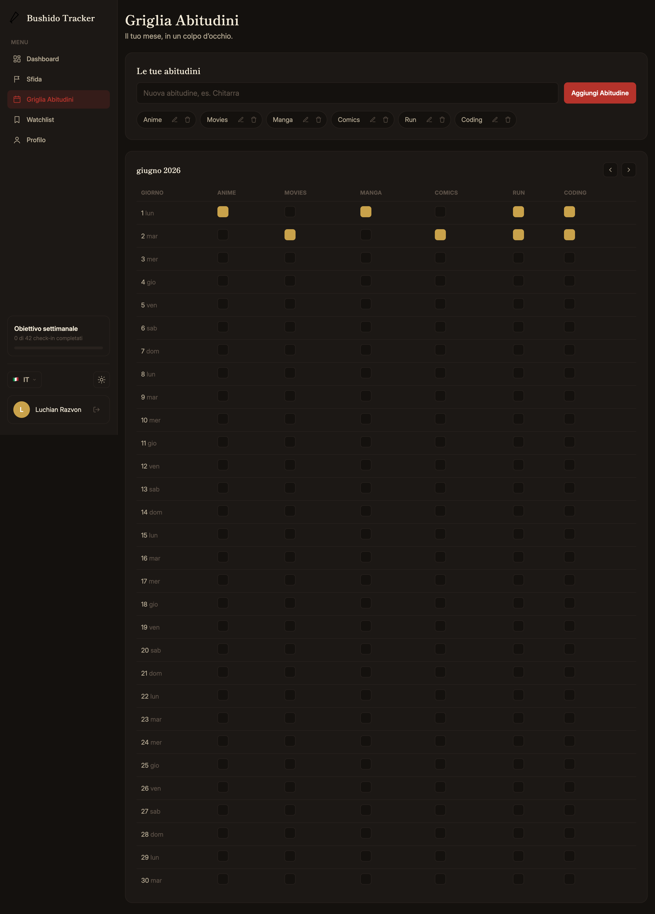
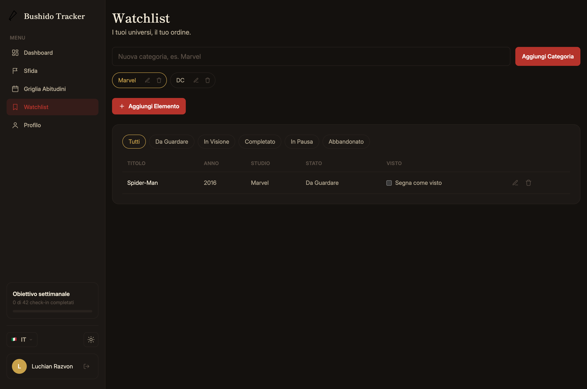

# Bushido Tracker

A habit, challenge, and watchlist tracker with a samurai-inspired theme.

## Screenshots

| | |
|---|---|
|  |  |
|  |  |
|  |  |
|  | |

## Features

- **Dashboard** — daily greeting, streak/completion stats, a GitHub-style consistency map, today's progress ring, a completion trend chart (30d/90d/1y), and a watchlist-by-category breakdown.
- **Samurai Challenge** — date-range challenges with manual or automatic day completion, full edit support (name, dates, mode).
- **Habit Grid** — user-defined habits tracked on a monthly grid, with month navigation.
- **Watchlist** — your own categories (anime, games, movies, books, ...) with titles, status (plan to watch / watching / completed / on hold / dropped), and watched timestamps.
- **Profile** — account info and account deletion.
- Dark/light theme, 9 languages (EN/IT/RU/ES/FR/DE/JA/ZH/PT), a custom modal and dropdown system (no native browser popups), responsive layout with a collapsible mobile sidebar.

## Stack

- React + Vite + TypeScript
- Tailwind CSS v4
- Firebase Authentication + Firestore
- React Router

## Project structure

```
src/
  components/
    layout/      Sidebar, AppLayout, route guards
    ui/           Button, Field, Modal, Toast, charts, icons, etc.
  hooks/          useAuth, useTheme, useTranslation, useToast, useModal
  i18n/           translation dictionaries (locales/) + i18n helpers
  lib/            pure helpers: dates, streak math, avatar colors, shared types
  pages/          one component per route (Home, Login, Dashboard, ...)
  services/       Firestore/Auth data access, one file per feature
  firebase/       Firebase app initialization
```

## Development

```bash
npm install
npm run dev
```

## Build

```bash
npm run build
```

## Firebase setup

This app expects a Firebase project with **Authentication** (Email/Password + Google providers) and **Firestore** enabled. The Firestore security rules are in `firestore.rules` — every document under `users/{uid}` is only readable/writable by that user.

Data model:

```
users/{uid}
  displayName, email, createdAt

users/{uid}/challenges/{id}
  name, startDate, endDate, mode, completedDates, createdAt

users/{uid}/habitGridHabits/{id}
  name, createdAt

users/{uid}/habitGridMonths/{YYYY-MM}
  days: { "1": { habitId: true }, ... }

users/{uid}/watchlistCategories/{id}
  name, createdAt
users/{uid}/watchlistCategories/{id}/items/{id}
  title, year, studio, status, watchedAt, createdAt
```

## Deployment

The app is a static SPA (Vite build output in `dist/`) and deploys cleanly to Vercel — `vercel.json` already rewrites all paths to `index.html` for client-side routing.

After deploying, add the deployment domain to **Firebase Console → Authentication → Settings → Authorized domains**, or sign-in will fail on the live site.
